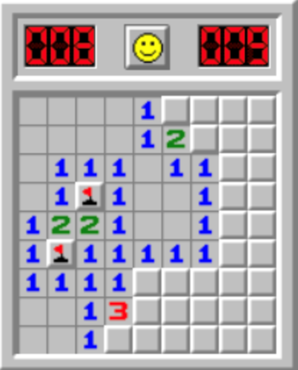
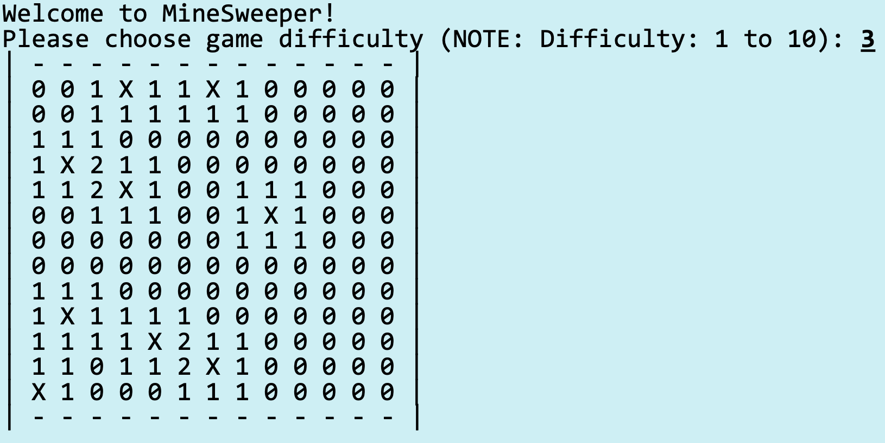

# Java Case Study: From Basics to Minesweeper

## Practice: Think - Array Bounds and Loop Logic

What is the output of this Java program?

```java
public class Demo {
    public static void main(String[] args) {
        int[] nums = {1, 4, 4, 8, 13};
        int totalDiff = 0;
        for (int i = 1; i <= nums.length; i++) {
            totalDiff += (nums[i] - nums[i - 1]);
        }
        System.out.println("Total Diff = " + totalDiff);
    }
}
```

(A) Total Diff = 12  
(B) Total Diff = 10  
(C) Total Diff = 9  
(D) Exception!

### Analysis: Understanding the Problem

Let's break down what this code is trying to do and why it fails:

**What the code intends to do:**
- Calculate the sum of differences between consecutive elements in the array
- For array `{1, 4, 4, 8, 13}`, it should calculate: (4-1) + (4-4) + (8-4) + (13-8) = 3 + 0 + 4 + 5 = 12

**The Problem - Array Index Out of Bounds:**
```java
// Array indices: 0  1  2  3  4
int[] nums = {1, 4, 4, 8, 13};
// Length = 5, valid indices: 0, 1, 2, 3, 4

for (int i = 1; i <= nums.length; i++) {  // i goes from 1 to 5
    totalDiff += (nums[i] - nums[i - 1]); // When i=5, nums[5] causes ArrayIndexOutOfBoundsException
}
```

**Step-by-step execution analysis:**
```java
// Loop iteration analysis:
// i=1: nums[1] - nums[0] = 4 - 1 = 3, totalDiff = 3
// i=2: nums[2] - nums[1] = 4 - 4 = 0, totalDiff = 3
// i=3: nums[3] - nums[2] = 8 - 4 = 4, totalDiff = 7
// i=4: nums[4] - nums[3] = 13 - 8 = 5, totalDiff = 12
// i=5: nums[5] - nums[4] = ❌ ArrayIndexOutOfBoundsException!
```

**Corrected Version:**
```java
public class Demo {
    public static void main(String[] args) {
        // Initialize array with values
        int[] nums = {1, 4, 4, 8, 13};
        
        // Variable to store cumulative difference
        int totalDiff = 0;
        
        // Fix: Use < instead of <= to avoid going out of bounds
        // Loop from index 1 to length-1 (exclusive)
        for (int i = 1; i < nums.length; i++) {
            // Calculate difference between current and previous element
            totalDiff += (nums[i] - nums[i - 1]);
        }
        
        // Output the result
        System.out.println("Total Diff = " + totalDiff); // Output: Total Diff = 12
    }
}
```

**Key Java Concepts Demonstrated:**
1. **Array Indexing**: Java arrays are 0-indexed (first element is at index 0)
2. **Bounds Checking**: Always ensure loop conditions don't exceed array length
3. **Exception Handling**: ArrayIndexOutOfBoundsException occurs when accessing invalid indices
4. **Loop Control**: Understanding the difference between `<` and `<=` in loop conditions
5. **Variable Scope**: Understanding how variables are used within loops

---

## Case Study: Minesweeper - A Deep Dive into Java Programming

### What is Minesweeper?

Minesweeper is a classic puzzle game that teaches fundamental programming concepts through gameplay. It's an excellent case study for learning Java because it involves:

- **2D Arrays**: Representing the game board
- **Control Structures**: Loops and conditionals for game logic
- **Object-Oriented Design**: Classes for game state, cells, and game logic
- **User Input**: Handling mouse clicks and user interactions
- **Algorithm Design**: Flood fill algorithm for revealing empty cells



### Game Mechanics Explained

#### 1. Board Structure - Using Enums for Type Safety

The game board is a 2D grid where each cell can be in different states. We use **enums** to ensure type safety and make the code more readable:

```java
// Enum: A special class that represents a group of constants
// This prevents invalid states and makes code more readable
public enum CellState {
    HIDDEN,     // Cell not yet revealed (initial state)
    REVEALED,   // Cell has been clicked and shown to player
    FLAGGED     // Player marked as potential mine (right-click)
}

// Another enum for the content type of each cell
public enum CellContent {
    EMPTY,      // No adjacent mines (shows as blank when revealed)
    MINE,       // Contains a mine (game over if clicked)
    NUMBER      // Contains a number (1-8) indicating adjacent mines
}
```

**Why use enums?**
- **Type Safety**: Can't accidentally assign invalid values
- **Readability**: `CellState.HIDDEN` is clearer than `0`
- **Maintainability**: Easy to add new states without breaking existing code
- **IDE Support**: Better autocomplete and error detection

#### 2. Cell Class Design - Object-Oriented Principles

Each cell in the game is represented by a `Cell` object, demonstrating encapsulation and data hiding:

```java
public class Cell {
    // Private fields - encapsulation principle
    // Only this class can directly access these variables
    private CellState state;        // Current state (hidden, revealed, flagged)
    private CellContent content;    // What's in the cell (empty, mine, number)
    private int adjacentMines;      // Number of mines in adjacent cells (0-8)
    private boolean isMine;         // Whether this cell contains a mine
    
    // Constructor - called when creating a new Cell object
    public Cell() {
        // Initialize all fields to default values
        this.state = CellState.HIDDEN;      // Start hidden
        this.content = CellContent.EMPTY;   // Start empty (no mine)
        this.adjacentMines = 0;             // No adjacent mines initially
        this.isMine = false;                // Not a mine initially
    }
    
    // Getter method - provides controlled access to private field
    public boolean isMine() { 
        return isMine; 
    }
    
    // Setter method - provides controlled access to modify private field
    public void setMine(boolean mine) { 
        this.isMine = mine; 
        // Update content based on mine status
        this.content = mine ? CellContent.MINE : CellContent.EMPTY;
    }
    
    // Method to reveal the cell
    public void reveal() {
        // Only reveal if not flagged (can't reveal flagged cells)
        if (state != CellState.FLAGGED) {
            state = CellState.REVEALED;
        }
    }
    
    // Method to flag/unflag the cell
    public void toggleFlag() {
        if (state == CellState.HIDDEN) {
            state = CellState.FLAGGED;
        } else if (state == CellState.FLAGGED) {
            state = CellState.HIDDEN;
        }
    }
    
    // Override toString() method for display purposes
    // This method is called automatically when printing the object
    @Override
    public String toString() {
        if (state == CellState.HIDDEN) return "□";      // Hidden cell
        if (state == CellState.FLAGGED) return "🚩";    // Flagged cell
        if (isMine) return "💣";                        // Mine (when revealed)
        if (adjacentMines == 0) return " ";             // Empty revealed cell
        return String.valueOf(adjacentMines);           // Number (1-8)
    }
    
    // Additional getter methods for encapsulation
    public CellState getState() { return state; }
    public int getAdjacentMines() { return adjacentMines; }
    public void setAdjacentMines(int count) { this.adjacentMines = count; }
}
```

**Object-Oriented Concepts Demonstrated:**
- **Encapsulation**: Private fields with public getter/setter methods
- **Data Hiding**: Internal state is protected from external modification
- **Method Overriding**: Custom `toString()` method for display
- **Constructor**: Initialization of object state

#### 3. Game Board Implementation - 2D Arrays and Class Design

The game board manages the entire game state using a 2D array of Cell objects:

```java
// Import required for random number generation
import java.util.Random;

public class MinesweeperBoard {
    // Instance variables (fields) - each board has its own copy
    private Cell[][] board;         // 2D array of Cell objects
    private int rows, cols;         // Board dimensions
    private int totalMines;         // Number of mines to place
    private boolean gameOver;       // Game state flag
    private boolean gameWon;        // Win state flag
    
    // Constructor - creates a new game board
    public MinesweeperBoard(int rows, int cols, int mines) {
        // Validate input parameters
        if (rows <= 0 || cols <= 0 || mines < 0 || mines > rows * cols) {
            throw new IllegalArgumentException("Invalid board parameters");
        }
        
        // Initialize instance variables
        this.rows = rows;
        this.cols = cols;
        this.totalMines = mines;
        this.board = new Cell[rows][cols];  // Create 2D array
        this.gameOver = false;
        this.gameWon = false;
        
        // Set up the game board
        initializeBoard();
        placeMines();
        calculateAdjacentMines();
    }
    
    // Private helper method to create all cells
    private void initializeBoard() {
        // Nested loops to traverse 2D array
        for (int i = 0; i < rows; i++) {
            for (int j = 0; j < cols; j++) {
                // Create a new Cell object at each position
                board[i][j] = new Cell();
            }
        }
    }
    
    // Place mines randomly on the board
    private void placeMines() {
        Random random = new Random();  // Random number generator
        int minesPlaced = 0;           // Counter for placed mines
        
        // Keep placing mines until we have the required number
        while (minesPlaced < totalMines) {
            // Generate random position
            int row = random.nextInt(rows);  // Random row (0 to rows-1)
            int col = random.nextInt(cols);  // Random column (0 to cols-1)
            
            // Only place mine if cell doesn't already have one
            if (!board[row][col].isMine()) {
                board[row][col].setMine(true);
                minesPlaced++;
            }
        }
    }
    
    // Calculate how many mines are adjacent to each cell
    private void calculateAdjacentMines() {
        // Traverse entire board
        for (int i = 0; i < rows; i++) {
            for (int j = 0; j < cols; j++) {
                // Only calculate for non-mine cells
                if (!board[i][j].isMine()) {
                    int count = countAdjacentMines(i, j);
                    board[i][j].setAdjacentMines(count);
                }
            }
        }
    }
    
    // Count mines in the 8 adjacent cells (including diagonals)
    private int countAdjacentMines(int row, int col) {
        int count = 0;
        
        // Check all 8 adjacent positions using nested loops
        for (int i = -1; i <= 1; i++) {      // Row offset: -1, 0, 1
            for (int j = -1; j <= 1; j++) {  // Column offset: -1, 0, 1
                // Skip the center cell itself
                if (i == 0 && j == 0) continue;
                
                // Calculate adjacent position
                int newRow = row + i;
                int newCol = col + j;
                
                // Check if position is valid and contains a mine
                if (isValidPosition(newRow, newCol) && board[newRow][newCol].isMine()) {
                    count++;
                }
            }
        }
        return count;
    }
    
    // Helper method to check if a position is within board bounds
    private boolean isValidPosition(int row, int col) {
        return row >= 0 && row < rows && col >= 0 && col < cols;
    }
    
    // Getter methods for game state
    public boolean isGameOver() { return gameOver; }
    public boolean isGameWon() { return gameWon; }
    public int getRows() { return rows; }
    public int getCols() { return cols; }
}
```

**Key Concepts in Board Implementation:**
- **2D Arrays**: `Cell[][] board` represents rows and columns
- **Array Bounds Checking**: `isValidPosition()` prevents out-of-bounds access
- **Random Number Generation**: `Random` class for placing mines
- **Nested Loops**: Traversing 2D arrays requires nested iteration
- **Exception Handling**: Input validation with `IllegalArgumentException`

#### 4. Core Game Logic - Revealing Cells and Flood Fill Algorithm

The most complex part of Minesweeper is the cell revelation logic, which uses recursion:

```java
// Main method for revealing a cell when player clicks
public void revealCell(int row, int col) {
    // Early return conditions (guard clauses)
    if (!isValidPosition(row, col) || gameOver) {
        return;  // Exit method early if conditions aren't met
    }
    
    // Get the cell at the specified position
    Cell cell = board[row][col];
    
    // Only reveal if cell is hidden (not already revealed or flagged)
    if (cell.getState() != CellState.HIDDEN) {
        return;
    }
    
    // Reveal the cell
    cell.reveal();
    
    // Check if player hit a mine
    if (cell.isMine()) {
        gameOver = true;
        revealAllMines();  // Show all mines when game ends
        return;
    }
    
    // If cell has no adjacent mines, use flood fill to reveal adjacent cells
    if (cell.getAdjacentMines() == 0) {
        floodFill(row, col);
    }
    
    // Check if player has won
    checkWinCondition();
}

// Recursive flood fill algorithm - reveals connected empty cells
private void floodFill(int row, int col) {
    // Check all 8 adjacent positions
    for (int i = -1; i <= 1; i++) {
        for (int j = -1; j <= 1; j++) {
            // Skip the center cell
            if (i == 0 && j == 0) continue;
            
            // Calculate adjacent position
            int newRow = row + i;
            int newCol = col + j;
            
            // Check if position is valid
            if (isValidPosition(newRow, newCol)) {
                Cell adjacentCell = board[newRow][newCol];
                
                // Only process hidden cells
                if (adjacentCell.getState() == CellState.HIDDEN) {
                    // Reveal the adjacent cell
                    adjacentCell.reveal();
                    
                    // If it's also empty, recursively flood fill from there
                    if (adjacentCell.getAdjacentMines() == 0) {
                        floodFill(newRow, newCol);
                    }
                }
            }
        }
    }
}

// Reveal all mines when game ends (for debugging or game over)
private void revealAllMines() {
    for (int i = 0; i < rows; i++) {
        for (int j = 0; j < cols; j++) {
            if (board[i][j].isMine()) {
                board[i][j].reveal();
            }
        }
    }
}
```

**Recursion and Algorithm Concepts:**
- **Recursion**: `floodFill()` calls itself to reveal connected empty cells
- **Base Case**: Recursion stops when no more empty cells are found
- **Guard Clauses**: Early returns prevent unnecessary processing
- **Flood Fill Algorithm**: Classic algorithm for filling connected regions

#### 5. Game State Management and User Interface

Managing game state and providing user feedback:

```java
// Display the current state of the board
public void printBoard() {
    // Print column headers
    System.out.print("  ");  // Space for row numbers
    for (int j = 0; j < cols; j++) {
        System.out.print(j + " ");  // Column numbers
    }
    System.out.println();  // New line after headers
    
    // Print each row with row numbers
    for (int i = 0; i < rows; i++) {
        System.out.print(i + " ");  // Row number
        for (int j = 0; j < cols; j++) {
            // Use Cell's toString() method for display
            System.out.print(board[i][j] + " ");
        }
        System.out.println();  // New line after each row
    }
}

// Check if player has won the game
private void checkWinCondition() {
    int revealedCount = 0;
    
    // Count all revealed non-mine cells
    for (int i = 0; i < rows; i++) {
        for (int j = 0; j < cols; j++) {
            Cell cell = board[i][j];
            if (cell.getState() == CellState.REVEALED && !cell.isMine()) {
                revealedCount++;
            }
        }
    }
    
    // Win condition: all non-mine cells are revealed
    int totalNonMineCells = rows * cols - totalMines;
    if (revealedCount == totalNonMineCells) {
        gameWon = true;
        gameOver = true;
    }
}

// Method to flag/unflag a cell
public void toggleFlag(int row, int col) {
    if (isValidPosition(row, col) && !gameOver) {
        board[row][col].toggleFlag();
    }
}
```

**User Interface Concepts:**
- **Console Output**: Using `System.out.print()` and `System.out.println()`
- **String Formatting**: Building readable output with spaces and newlines
- **Game State Tracking**: Maintaining win/lose conditions
- **Input Validation**: Ensuring moves are valid before processing

### Complete Working Example with User Interaction

```java
// Import required for user input
import java.util.Scanner;

public class MinesweeperGame {
    public static void main(String[] args) {
        // Create a 5x5 board with 4 mines
        MinesweeperBoard board = new MinesweeperBoard(5, 5, 4);
        Scanner scanner = new Scanner(System.in);
        
        System.out.println("Welcome to Minesweeper!");
        System.out.println("Enter row and column to reveal a cell (e.g., '2 3')");
        System.out.println("Enter 'f' followed by row and column to flag (e.g., 'f 2 3')");
        System.out.println();
        
        // Main game loop
        while (!board.isGameOver()) {
            // Display current board state
            board.printBoard();
            System.out.println();
            
            // Get user input
            System.out.print("Enter command: ");
            String input = scanner.nextLine().trim();
            
            try {
                if (input.startsWith("f ")) {
                    // Flag command
                    String[] parts = input.substring(2).split("\\s+");
                    int row = Integer.parseInt(parts[0]);
                    int col = Integer.parseInt(parts[1]);
                    board.toggleFlag(row, col);
                } else {
                    // Reveal command
                    String[] parts = input.split("\\s+");
                    int row = Integer.parseInt(parts[0]);
                    int col = Integer.parseInt(parts[1]);
                    board.revealCell(row, col);
                }
            } catch (NumberFormatException | ArrayIndexOutOfBoundsException e) {
                System.out.println("Invalid input! Please enter numbers only.");
            }
            
            // Check game end conditions
            if (board.isGameWon()) {
                System.out.println("🎉 Congratulations! You won! 🎉");
            } else if (board.isGameOver()) {
                System.out.println("💥 Game Over! You hit a mine! 💥");
            }
        }
        
        // Show final board state
        board.printBoard();
        scanner.close();
    }
}
```

**User Interaction Concepts:**
- **Scanner Class**: Reading user input from console
- **String Processing**: Parsing commands and coordinates
- **Exception Handling**: Catching invalid input gracefully
- **Game Loop**: Continuous interaction until game ends
- **Input Validation**: Ensuring coordinates are within bounds

### Key Java Programming Concepts Demonstrated

1. **2D Arrays**: `Cell[][] board` for representing the game grid
2. **Enums**: `CellState` and `CellContent` for type safety
3. **Classes and Objects**: `Cell` and `MinesweeperBoard` classes
4. **Recursion**: Flood fill algorithm for revealing empty cells
5. **Control Structures**: Nested loops for board traversal
6. **Exception Handling**: Bounds checking and input validation
7. **Random Number Generation**: Placing mines randomly
8. **User Input**: Scanner for reading player moves
9. **String Processing**: Parsing and validating user commands
10. **Object-Oriented Design**: Encapsulation, inheritance, and polymorphism principles

### Learning Outcomes

This Minesweeper implementation teaches:
- **Problem Decomposition**: Breaking complex game into manageable components
- **Algorithm Design**: Flood fill, mine counting, win condition checking
- **Data Structures**: 2D arrays, enums, and object relationships
- **Game State Management**: Tracking game progress and conditions
- **User Interface Design**: Console-based game interaction
- **Debugging Skills**: Understanding program flow and state changes
- **Code Organization**: Separating concerns into different classes and methods



The output shows a typical game state where:
- Numbers indicate adjacent mines (1-8)
- Empty spaces (revealed) show no adjacent mines
- Hidden cells are represented by □
- Flags (🚩) mark suspected mine locations
- Mines (💣) are revealed when game ends

This case study provides a comprehensive introduction to Java programming concepts through an engaging, familiar game that students can both play and understand at a code level. The detailed annotations and explanations help students grasp both the "what" and "why" of each programming concept.